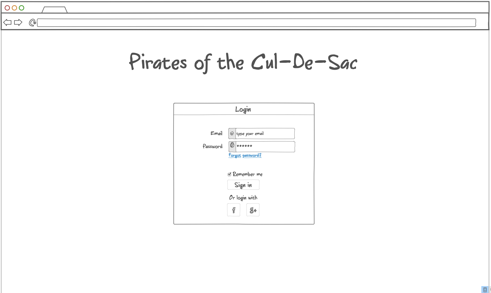

# Startup

## Elevator Pitch

Have you ever wanted to do a treasure hunt? Ok but like, not a lame one? One where you have to decipher cryptic messages, or maybe do some serious land navigation?
Then "Pirates of the Cul-de-sac" is right up your alley! Make an account and then pick from a number of different treasure hunts. Depending on the treasure hunt, 
there wil be a picture, or a series of crytpic messages that lead to it. Don't worry, there will be some really easy ones for the beginners to get their feet wet. 
Upon discovery the winner will find a code that they will use to prove that they in fact found it. Upon redeeming the code, you will recieve an alotment of points 
relative to the difficulty of that hunt. There will be a leaderboard for the "Pirates" with the most points. It's a great date idea, and also just a great way to 
get outside, have fun, and get active!

---
## Key Features

- Secure login over https
- Main menu with descriptions of the different hunts
- Ability to pick a hunt and navigate to its own page containing hints and pictures
- Ability to redeem a code and earn points upon completing hunts
- Points earned are saved to the users account
- Ability to view leaderboard and see the top "Pirates"

---
## Technologies

- HTML - To start there will be 9 HTML pages. One for the sign up, one for login, one for "forgot password", one for "reset password", one for the menu with all the different treasure hunts (3 to start), one for each individual treasure hunt, and then one for the leaderboard.
- CSS - Application styling with a cool treasure hunting theme. Aesthetically pleasing.
- JavaScript - Provides login, allows for redemption of codes, and displays each user's points on the leaderboard.
- Service - Backend service with endpoints for:
    - login
    - redeeming codes for points
    - retrieving user points
- DataBase - Store users and their number of points
- Login - Register and login users. Credentials securely stored in database. Can't redeem code unless authenticated.
- WebSocket - As each user redeems codes and earns points, their updated points are reflected on the leaderboards for all 8. other users.
- React - Application ported to use the react framework
  
---
## Design Images

