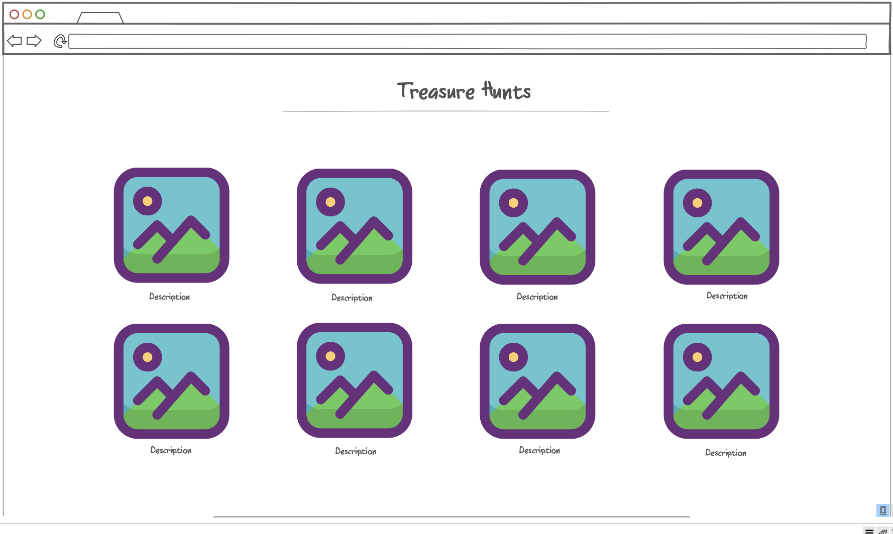

# Startup

## Elevator Pitch

Have you ever wanted to do a treasure hunt? Ok but like, not a lame one? One where you have to decipher cryptic messages, or maybe do some serious land navigation?
Then "Pirates of the Cul-de-sac" is right up your alley! Make an account and then pick from a number of different treasure hunts. Each treasure hunt will have a few pictures and a series of crytpic messages that lead to it. Don't worry, there will be some really easy ones for the beginners to get their feet wet. 
Upon discovery the winner will find a code that they will use to prove that they in fact found the treasure. Upon redeeming the code, you will recieve an alotment of points 
relative to the difficulty of that hunt. There will be a leaderboard for the "Pirates" with the most points. It's a great date idea, and also just a great way to 
get outside, have fun, and get active!

---
## Key Features

- Secure login over https
- Main menu with descriptions of the different hunts
- Ability to pick a hunt and navigate to its own page containing hints and pictures
- Ability to redeem a code and earn points upon completing hunts
- Points earned are saved to the users account
- Ability to view leaderboard and see the top "Pirates"

---
## Technologies

- HTML - To start there will be 7 HTML pages. One for the sign up, one for login, one for the menu with all the different treasure hunts (3 to start), one for each individual treasure hunt, and then one for the leaderboard.
- CSS - Application styling with a cool treasure hunting theme. Aesthetically pleasing.
- JavaScript - Provides signup, login, allows for redemption of codes, and displays each user's points on the leaderboard.
- Service - Backend service with endpoints for:
    - login
    - redeeming codes for points
    - retrieving user points
- DataBase - Store users and their number of points
- Login - Register and login users. Credentials securely stored in database. Can't redeem code unless authenticated.
- WebSocket - As each user redeems codes and earns points, their updated points are reflected on the leaderboards for all 8. other users.
- React - Application ported to use the react framework
  
---
## HTML Deliverable

For this Deliverable I built out the structure of my application in HTML.
- **HTML pages** - 7 in all; One for the home page, one for each hunt (3), one for the leaderboard, one for login, and one for sign up.
- **Links** - The home page links to each hunt's page, the leaderboard, and the sign up and log in pages. Every other page links back to the home page. You can also access the leaderboard from each individual hunt's page.
- **Text** - Each hunt has a textual description of the clues leading to the "treasure".
- **Images** - Each hunt has a picture of the general area where the treaure is hidden. There is also a pirate themes banner in the header of each page.
- **Login & Sign up** - input boxes and submit buttons for both the sign up and login pages.
- **Database** - Each user's points will be stored in the database and can be viewed from the leaderboard.
- **WebSocket** - Redeeming codes on the client's side will add points to that user's account stored on the server. I think that's how WebSockets work, but I'm honestly not super sure.
  
---
## CSS Deliverable
For this deliverable I properly styled the application into its final appearance.
- **Header, footer, and main body content**
- **Window Resizing** - I've tested the website on multiple window sizes, including my iphone 12 mini! And it looks good, or at least it looks as good as it is supposed to. :P
- **Application elements** - It has good contrast, and I tried to make it look nice!
- **Application text content** - Consistent fonts
- **Application images** - Added some opacity to the header picture to boost contrast.
  
---
## JavaScript Deliverable
For this deliverable I got as much JavaScript working as I think I possibly could, though I'm not entirely sure.
- **Signup** - Creates user and then takes them to login page to login.
- **Login** - Checkes credentials to see if user exists, and if the user does exists, it logs them into their account.
- **Redeeming Points** - Allows user to use codes to redeem points. The points are saved to the user's account, and each code can only be used once by the user.
- **Leaderboard** - Displays the user by their user and their points on the leaderboard.
- **Testing for TA's** - If you'd like to test point redemption. You'll have to signup and login, then navigate to one of the treasure hunt pages and redeem a code at the bottom. It doesn't matter which hunt you pick, you can redeem any code from any of the pages. One of the codes is "347159". It should award you 10 points which will now be visible on the leaderboard. :)
    
---

## Service Deliverable
For this deliverable I added backend endpoints that receives signup info, login info, codes for point redemotion, and returns the top users' point values to the leaderboard.
- **Node.js/Express HTTP service** - done!
- **Static middleware for frontend** - done!
- **Backend Service Endpoints** - I have Signup and Login working. I'm still figuring out code redemption.
    
---
## Design Images

